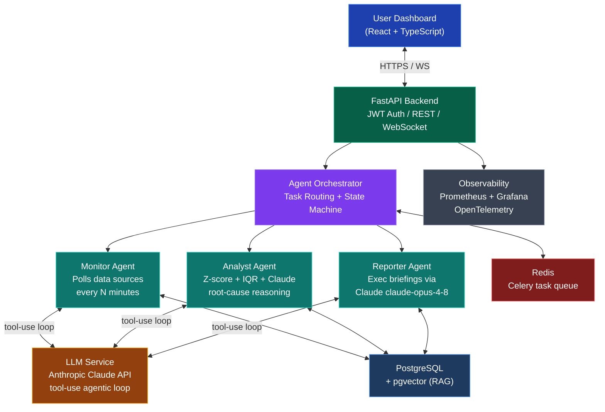

<div align="center">


<br/>

[](LICENSE)
[](https://python.org)
[](https://fastapi.tiangolo.com)
[](https://react.dev)
[](https://anthropic.com)
[](docker-compose.yml)

<br/>

> ### **The AI that watches your business 24/7 — so you don't have to.**
>
> *Autonomous anomaly detection + root-cause analysis + executive briefings, all on autopilot.*

<br/>

[**Quick Start**](#-quick-start) &nbsp;|&nbsp; [**Architecture**](#-architecture) &nbsp;|&nbsp; [**Features**](#-features) &nbsp;|&nbsp; [**API**](#-api-reference) &nbsp;|&nbsp; [**Contributing**](#-contributing)

</div>

---

## 🎯 The Problem Meridian Solves

Traditional BI is **reactive**. You open a dashboard. You ask questions. You find problems — after they've hurt you.

**Meridian is proactive.** It monitors everything, reasons about context, and delivers answers before your team even knows to ask.

<br/>

<div align="center">

| | Traditional BI | **Meridian AI** |
|:---|:---:|:---:|
| **Anomaly Detection** | Manual thresholds | AI-contextual detection |
| **Root Cause Analysis** | You investigate for hours | Autonomous agent investigation |
| **Reporting** | Manual dashboards | Auto-generated executive briefings |
| **Response Time** | Hours to days | **< 5 minutes** |
| **Learns Over Time** | Static rules | Continuous feedback loop |

</div>

---

## Architecture



---

## Tech Stack

<div align="center">

### Backend
[](https://python.org)
[](https://fastapi.tiangolo.com)
[](https://sqlalchemy.org)
[](https://docs.celeryq.dev)
[](https://docs.pydantic.dev)

### AI & Data
[](https://anthropic.com)
[](https://github.com/pgvector/pgvector)
[](https://scikit-learn.org)
[](https://opentelemetry.io)

### Frontend & Infrastructure
[](https://react.dev)
[](https://typescriptlang.org)
[](https://postgresql.org)
[](https://redis.io)
[](docker-compose.yml)
[](https://grafana.com)

</div>

---

## Features

### Multi-Agent AI Pipeline

```
Data Source --> [Monitor Agent] --> [Analyst Agent] --> [Reporter Agent] --> Executive Briefing
                  Polls every         Z-score + IQR         Claude opus          Delivered in
                  15 minutes          + Claude RCA           synthesis            < 5 minutes
```

| Agent | Role | AI Capability |
|:---|:---|:---|
| **MonitorAgent** | Polls PostgreSQL, REST APIs, webhooks on schedule | Autonomous scheduling with Celery |
| **AnalystAgent** | Detects anomalies statistically then investigates with Claude | Z-score, IQR, + chain-of-thought RCA |
| **ReporterAgent** | Generates C-suite-ready briefings | Full Claude `claude-opus-4-8` synthesis |
| **Orchestrator** | Routes tasks, manages agent state machine | Priority queue + retry logic |

### Enterprise Features

| Category | Capabilities |
|:---|:---|
| **Security** | JWT/OAuth2, RBAC (Admin/Analyst/Viewer), row-level multi-tenancy |
| **Compliance** | Immutable audit log, encryption at rest + in transit, SOC2-ready |
| **Observability** | OpenTelemetry spans per agent, LLM cost tracking, Prometheus + Grafana |
| **Integrations** | PostgreSQL, Snowflake, BigQuery, Redshift, REST, Slack, PagerDuty, Jira |
| **Scalability** | Stateless API + Redis Celery = horizontal scale, Docker Compose or K8s |

---

## Quick Start

### Prerequisites
- Docker & Docker Compose v2+
- [Anthropic API key](https://console.anthropic.com)

### 1. Clone & Configure

```bash
git clone https://github.com/avase33/meridian-ai.git
cd meridian-ai
cp .env.example .env
# Add your ANTHROPIC_API_KEY to .env
```

### 2. Start All Services

```bash
docker-compose up -d
```

| Service | URL |
|:---|:---|
| **API + Swagger Docs** | http://localhost:8000/docs |
| **React Dashboard** | http://localhost:3000 |
| **Grafana Metrics** | http://localhost:3001 |

### 3. Create Your First Monitoring Agent

```python
import httpx

client = httpx.Client(base_url="http://localhost:8000/api/v1")

# Authenticate
token = client.post("/auth/login", json={
    "email": "admin@example.com",
    "password": "changeme"
}).json()["access_token"]

client.headers["Authorization"] = f"Bearer {token}"

# Deploy a Revenue Monitor agent
agent = client.post("/agents", json={
    "name": "Revenue Monitor",
    "type": "monitor",
    "config": {
        "data_source": {
            "type": "postgresql",
            "dsn": "postgresql://user:pass@db/analytics"
        },
        "query": "SELECT SUM(revenue) AS total FROM sales WHERE date = CURRENT_DATE",
        "schedule": "*/15 * * * *",   # every 15 minutes
        "alert_threshold_pct": 15      # alert on >15% deviation
    }
}).json()

print(f"Agent deployed: {agent['id']}")
# Meridian now autonomously monitors revenue and alerts you on drops.
```

---

## API Reference

<details>
<summary><strong>Authentication</strong></summary>

```http
POST /api/v1/auth/login
Content-Type: application/json

{ "email": "admin@company.com", "password": "..." }
```

Returns `{ "access_token": "eyJ...", "token_type": "bearer" }`

</details>

<details>
<summary><strong>Agent Management</strong></summary>

```http
GET    /api/v1/agents           # List all agents
POST   /api/v1/agents           # Create agent
GET    /api/v1/agents/{id}      # Get agent details
PUT    /api/v1/agents/{id}      # Update agent config
DELETE /api/v1/agents/{id}      # Delete agent
POST   /api/v1/agents/{id}/run  # Trigger immediate run
```

</details>

<details>
<summary><strong>Insights Feed</strong></summary>

```http
GET  /api/v1/insights              # Get insight feed (paginated)
GET  /api/v1/insights/{id}         # Get single insight + reasoning chain
POST /api/v1/insights/{id}/feedback # Submit thumbs up/down feedback
```

</details>

---

## Project Structure

```
meridian-ai/
├── backend/
│   ├── app/
│   │   ├── agents/
│   │   │   ├── base.py           # Abstract BaseAgent + Claude tool-use loop
│   │   │   ├── orchestrator.py   # Multi-agent pipeline coordinator
│   │   │   ├── monitor_agent.py  # Data polling + Celery scheduling
│   │   │   ├── analyst_agent.py  # Statistical detection + LLM root-cause
│   │   │   └── reporter_agent.py # Executive briefing via Claude
│   │   ├── api/v1/
│   │   │   ├── auth.py           # JWT login endpoint
│   │   │   ├── agents.py         # Agent CRUD + trigger
│   │   │   └── insights.py       # Insight feed + feedback
│   │   ├── models/               # SQLAlchemy ORM (User, Agent, Insight)
│   │   ├── services/
│   │   │   └── llm_service.py    # Anthropic async wrapper + cost tracking
│   │   ├── config.py             # Pydantic Settings
│   │   ├── database.py           # Async SQLAlchemy sessions
│   │   └── main.py               # FastAPI entry point
│   ├── tests/
│   │   └── test_agents.py        # Pytest unit tests with mocking
│   ├── Dockerfile
│   └── requirements.txt
├── frontend/
│   └── src/
│       ├── App.tsx               # React Router setup
│       └── pages/Dashboard.tsx   # Stats cards + LineChart + Insight feed
├── docs/
│   └── ARCHITECTURE.md
├── .github/
│   └── workflows/ci.yml          # Lint + Test + Security + Docker build
├── docker-compose.yml            # Full stack: API + Worker + PG + Redis + Grafana
└── .env.example
```

---

## Configuration

| Variable | Description | Required |
|:---|:---|:---:|
| `ANTHROPIC_API_KEY` | Claude API key | **Yes** |
| `DATABASE_URL` | PostgreSQL DSN | **Yes** |
| `REDIS_URL` | Redis DSN | **Yes** |
| `SECRET_KEY` | JWT signing secret (32+ chars) | **Yes** |
| `LLM_MODEL` | Claude model (default: `claude-opus-4-8`) | No |
| `MAX_AGENTS_PER_ORG` | Per-tenant agent cap | No |
| `ALLOWED_ORIGINS` | CORS allowed origins | No |

---

## Development

```bash
# Backend
cd backend
pip install -r requirements.txt
alembic upgrade head
uvicorn app.main:app --reload --port 8000

# Run tests
pytest tests/ -v --cov=app --cov-report=term-missing

# Lint
ruff check . && black --check .
```

---

## Contributing

Contributions are welcome! See [CONTRIBUTING.md](CONTRIBUTING.md) for guidelines.

[](CONTRIBUTING.md)

---

## License

MIT (c) [avase33](https://github.com/avase33) - see [LICENSE](LICENSE)

---

<div align="center">

[⭐ Star this repo](https://github.com/avase33/meridian-ai/stargazers) if Meridian helps you!

</div>